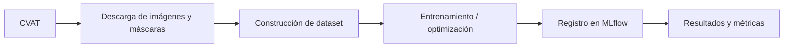

# Segmentation Training UI

Documentación de despliegue y uso de **Segmentation Training UI**, una aplicación web desarrollada con **Gradio** para lanzar entrenamientos de modelos de segmentación semántica desde una interfaz gráfica.

## Índice

- [Objetivo de la aplicación](#objetivo-de-la-aplicación)
- [Arquitectura funcional](#arquitectura-funcional)
- [Ubicación del despliegue](#ubicación-del-despliegue)
- [Acceso a la aplicación](#acceso-a-la-aplicación)
- [Requisitos de red](#requisitos-de-red)
- [Acceso a la máquina virtual](#acceso-a-la-máquina-virtual)
- [Ubicación del código en la VM](#ubicación-del-código-en-la-vm)
- [Entorno virtual](#entorno-virtual)
- [Instalación de dependencias](#instalación-de-dependencias)
- [Variables de entorno](#variables-de-entorno)
- [Cómo levantar la aplicación](#cómo-levantar-la-aplicación)
- [Uso básico desde la interfaz](#uso-básico-desde-la-interfaz)
- [Comprobación de uso de GPU](#comprobación-de-uso-de-gpu)
- [Logs y resultados](#logs-y-resultados)
- [MLflow](#mlflow)
- [Formato de datos y etiquetado](#formato-de-datos-y-etiquetado)
- [Consideraciones importantes](#consideraciones-importantes)
- [Problemas conocidos y soluciones](#problemas-conocidos-y-soluciones)
- [Apagado de la aplicación](#apagado-de-la-aplicación)
- [Estado actual](#estado-actual)
- [Mejoras futuras](#mejoras-futuras)

## Objetivo de la aplicación

La aplicación **Segmentation Training UI** permite lanzar entrenamientos de modelos de segmentación semántica desde una interfaz web desarrollada con **Gradio**.

El flujo principal de la aplicación es:

1. Conexión con CVAT.
2. Descarga de datos a partir de uno o varios `Task IDs`.
3. Generación automática de máscaras de segmentación.
4. Construcción del dataset de entrenamiento y validación.
5. Entrenamiento del modelo seleccionado.
6. Registro de parámetros, métricas y resultados en MLflow.

Actualmente la aplicación soporta los siguientes modelos:

- SegFormer
- MaskFormer
- FCN
- DeepLabV3

> **Nota:** Detectron2 se ha dejado fuera de la interfaz por problemas de dependencias y porque no es necesario para la demo actual.

## Arquitectura funcional



El pipeline visual de la interfaz muestra las siguientes fases:

```text
Labels > Data > Run > MLflow > Done
```

## Ubicación del despliegue

La aplicación está desplegada en una máquina virtual de **Google Cloud Platform**.

| Elemento | Valor |
|---|---|
| Proyecto GCP | `spa-ai-solutions-sdb-002` |
| Máquina virtual | `jjpa-training-cvat` |
| Zona | `europe-west1-b` |
| Uso | Entrenamiento de modelos de segmentación con GPU |

La máquina dispone de GPU NVIDIA y se utiliza para acelerar el entrenamiento mediante **CUDA**.

## Acceso a la aplicación

La aplicación se levanta con Gradio en el puerto:

```text
7860
```

Para que sea accesible desde fuera de la VM, debe lanzarse con:

```python
demo.launch(server_name="0.0.0.0", server_port=7860)
```

La URL de acceso tiene el siguiente formato:

```text
http://<IP_EXTERNA_DE_LA_VM>:7860
```

Ejemplo:

```text
http://34.118.254.147:7860
```

La IP externa se puede consultar desde Google Cloud Console:

```text
Compute Engine > VM instances > External IP
```

También puede consultarse desde la propia VM con:

```bash
curl ifconfig.me
```

## Requisitos de red

Para acceder a la aplicación desde el navegador es necesario que el puerto `7860` esté permitido en las reglas de firewall de Google Cloud.

Regla necesaria:

| Campo | Valor |
|---|---|
| Tipo | `Ingress` |
| Puerto | `tcp:7860` |
| Origen | `0.0.0.0/0` |

Mientras esta regla esté activa y la aplicación esté ejecutándose, cualquier usuario con la URL podrá acceder a la interfaz.

Por seguridad, se recomienda:

- Mantener la VM apagada cuando no se utilice.
- No dejar la aplicación expuesta innecesariamente.
- Restringir el origen de la regla de firewall si se quiere limitar el acceso.

## Acceso a la máquina virtual

La VM puede utilizarse mediante SSH desde Google Cloud Console o desde un cliente SSH local.

### Acceso desde navegador

En Google Cloud Console:

```text
Compute Engine > VM instances > jjpa-training-cvat > SSH
```

### Acceso con Google Cloud CLI

Desde una terminal local con Google Cloud CLI instalado:

```bash
gcloud compute ssh jjpa-training-cvat \
  --zone=europe-west1-b \
  --project=spa-ai-solutions-sdb-002
```

## Ubicación del código en la VM

El repositorio se encuentra dentro del home del usuario de la VM.

Ruta actual:

```bash
/home/jjpa_gft_com/gft-mlops-training-platform-dev/gft-mlops-training-platform-dev
```

Para entrar en el proyecto:

```bash
cd /home/jjpa_gft_com/gft-mlops-training-platform-dev/gft-mlops-training-platform-dev
```

## Entorno virtual

El entorno virtual utilizado se encuentra en:

```bash
/home/jjpa_gft_com/venv
```

Para activarlo:

```bash
source ~/venv/bin/activate
```

Una vez activado, el prompt debe mostrar algo similar a:

```bash
(venv) jjpa_gft_com@jjpa-training-cvat:~$
```

## Instalación de dependencias

Si se parte de una VM limpia, los pasos recomendados son:

```bash
cd /home/jjpa_gft_com/gft-mlops-training-platform-dev/gft-mlops-training-platform-dev
source ~/venv/bin/activate
pip install -r requirements.txt
```

Para usar GPU, PyTorch debe estar instalado con soporte CUDA. En esta VM se recomienda instalar PyTorch con CUDA 12.1:

```bash
pip install torch torchvision --index-url https://download.pytorch.org/whl/cu121
```

Validación de CUDA:

```bash
python -c "import torch; print(torch.cuda.is_available()); print(torch.cuda.get_device_name(0))"
```

Resultado esperado:

```text
True
<NOMBRE_DE_LA_GPU>
```

## Variables de entorno

La aplicación utiliza un archivo `.env` para configurar servicios externos.

Ejemplo de variables necesarias:

```env
CVAT_URL=http://<host_cvat>
CVAT_USERNAME=<usuario_cvat>
CVAT_PASSWORD=<password_cvat>
CVAT_CLOUD_STORAGE_ID=<id_storage>
MLFLOW_TRACKING_URI=http://<mlflow_host>:5000
```

Actualmente también se puede configurar CVAT desde la propia interfaz de Gradio mediante los campos:

- `CVAT URL`
- `CVAT Username`
- `CVAT Password`

Si estos campos se dejan vacíos, la aplicación utiliza los valores definidos en `.env`.

MLflow también se puede configurar desde la interfaz. Si el campo de `MLflow URI` se deja vacío, se utiliza `MLFLOW_TRACKING_URI` del `.env`.

## Cómo levantar la aplicación

Pasos para levantar la app desde la VM:

```bash
cd /home/jjpa_gft_com/gft-mlops-training-platform-dev/gft-mlops-training-platform-dev
source ~/venv/bin/activate
python gradio_app.py
```

La aplicación se levantará en:

```text
http://0.0.0.0:7860
```

Desde fuera de la VM se accede mediante:

```text
http://<IP_EXTERNA_DE_LA_VM>:7860
```

## Uso básico desde la interfaz

### Configuración general

En la interfaz se deben configurar los siguientes campos:

| Campo | Descripción |
|---|---|
| `Modo` | `train` u `optimize` |
| `Modelo` | `SegFormer`, `MaskFormer`, `FCN` o `DeepLabV3` |
| `Device` | `cpu` o `cuda` |
| `Experiment` | Nombre del experimento en MLflow |
| `Training name` | Nombre de la run |
| `MLflow URI` | Opcional; si se deja vacío, usa `.env` |
| `CVAT connection` | Opcional; si se deja vacío, usa `.env` |
| `CVAT Task IDs` | IDs de las tareas de CVAT, separados por comas |
| `Train split` | Proporción de datos para entrenamiento |

### Detección de clases

La aplicación detecta automáticamente las clases de segmentación desde CVAT.

Los labels de tipo `tag` se ignoran.

El número de clases se calcula como:

```text
número de labels de segmentación + background
```

Por tanto, el usuario no tiene que introducir manualmente el número de clases.

### Entrenamiento

Para lanzar un entrenamiento:

1. Seleccionar modo `train`.
2. Seleccionar modelo.
3. Seleccionar `cuda` si se quiere usar GPU.
4. Introducir `Task IDs` de CVAT.
5. Configurar hiperparámetros.
6. Pulsar **Ejecutar**.

### Optimización

Para lanzar optimización con Optuna:

1. Seleccionar modo `optimize`.
2. Seleccionar uno o varios bundles del modelo.
3. Definir rangos mínimos y máximos para hiperparámetros.
4. Definir `n_trials`.
5. Pulsar **Ejecutar**.

En modo optimización, los parámetros se definen mediante campos separados `min` y `max`, evitando que el usuario tenga que introducir listas separadas por comas.

## Comprobación de uso de GPU

Para comprobar que la GPU se está utilizando durante el entrenamiento, abrir otra terminal en la VM y ejecutar:

```bash
watch -n 1 nvidia-smi
```

Si el entrenamiento está usando GPU, se verá consumo de memoria y uso de GPU asociado al proceso de Python.

## Logs y resultados

La interfaz muestra:

- Estado del job.
- Fase actual del pipeline.
- Logs en vivo.
- Última run registrada en MLflow.
- Config generado para el entrenamiento.

## MLflow

Los resultados del entrenamiento se registran en **MLflow**.

Se registran, entre otros:

- Parámetros de entrenamiento.
- Hiperparámetros.
- Métricas de evaluación.
- Información de GPU si se utiliza CUDA.

La URI de MLflow puede venir de:

1. Campo de la interfaz.
2. Variable `MLFLOW_TRACKING_URI` del `.env`.

## Formato de datos y etiquetado

### Formato esperado por la aplicación

La aplicación trabaja con segmentación semántica, por lo que cada muestra está compuesta por:

- Imagen RGB.
- Máscara o label con valores enteros por píxel.

Estructura típica:

```text
image_001.jpg
label_001.png
```

Donde:

- La imagen es una fotografía normal.
- La máscara es una imagen en escala de grises o indexada.
- Cada valor de píxel representa una clase: `0`, `1`, `2`, etc.

Ejemplo:

| Valor | Clase |
|---|---|
| `0` | Fondo |
| `1` | Coche |
| `2` | Peatón |

### Cómo se etiqueta en CVAT

El etiquetado se realiza en **CVAT** mediante tareas de segmentación.

Flujo de etiquetado:

1. Crear una tarea en CVAT.
2. Subir imágenes, manualmente o desde cloud storage.
3. Definir las clases, por ejemplo: `background`, `road`, `car`, `person`.
4. Etiquetar usando herramientas como:
   - `Polygon`, la más común.
   - `Brush`, para segmentación más precisa.
5. Guardar anotaciones.

### Formato de exportación desde CVAT

En este proyecto se usa el formato:

```text
Segmentation mask (PNG)
```

Características:

- Una imagen por cada input.
- Mismo tamaño que la imagen original.
- Cada píxel contiene el ID de clase.

Alternativas disponibles en CVAT, no usadas directamente en este proyecto:

- COCO
- VOC

### Cómo interactúa el dato con la app

1. El usuario introduce los `task_id` de CVAT.
2. La app llama a CVAT vía API usando `cvat_sdk`.
3. Se descargan imágenes y máscaras.
4. Se guardan en:

```text
tmp/run_X/images/
tmp/run_X/masks/
```

Durante el entrenamiento:

- Se cargan como arrays.
- Se convierten a tensores.
- Se normalizan.

### Nota técnica importante

- Las máscaras deben estar bien formadas y no corruptas.
- Los valores deben estar dentro de `num_classes`.
- CVAT puede generar imágenes truncadas si la descarga falla.

## Consideraciones importantes

### Coste de la VM

La VM utiliza GPU, por lo que tiene coste asociado mientras está encendida.

Se recomienda apagar la VM cuando no se esté utilizando:

```text
Compute Engine > VM instances > jjpa-training-cvat > Stop
```

### Persistencia

Los archivos y el entorno virtual se mantienen aunque se cierre la sesión SSH o se apague la VM.

No se mantienen los procesos en ejecución si se cierra la sesión sin herramientas como `tmux`.

### Uso de tmux

Si se quiere dejar la aplicación corriendo aunque se cierre la terminal:

```bash
tmux
source ~/venv/bin/activate
cd /home/jjpa_gft_com/gft-mlops-training-platform-dev/gft-mlops-training-platform-dev
python gradio_app.py
```

Para salir sin detener el proceso:

```text
Ctrl + B, luego D
```

Para volver a entrar:

```bash
tmux attach
```

## Problemas conocidos y soluciones

### La app no carga desde la IP externa

Comprobar:

- La VM está encendida.
- La app está corriendo.
- Gradio se lanza con `server_name="0.0.0.0"`.
- El puerto `7860` está abierto en firewall.
- La IP externa es correcta.

### PyTorch no detecta GPU

Comprobar:

```bash
python -c "import torch; print(torch.cuda.is_available())"
```

Si devuelve `False`, reinstalar PyTorch con CUDA:

```bash
pip install torch torchvision --index-url https://download.pytorch.org/whl/cu121
```

### Error de imágenes truncadas

Algunas imágenes exportadas desde CVAT pueden aparecer como truncadas. Para evitar que PIL falle al cargarlas, los trainers incluyen:

```python
from PIL import ImageFile
ImageFile.LOAD_TRUNCATED_IMAGES = True
```

### CVAT SDK incompatible

Si aparece un error relacionado con `About._from_openapi_data`, revisar la versión de `cvat-sdk` e instalar la misma versión compatible con el servidor CVAT.

Ejemplo:

```bash
pip uninstall -y cvat-sdk
pip install cvat-sdk==2.56.0
```

## Apagado de la aplicación

Para detener Gradio:

```text
Ctrl + C
```

Para apagar la VM:

```text
Google Cloud Console > Compute Engine > VM instances > Stop
```

## Estado actual

La aplicación se encuentra desplegada en VM con GPU y permite:

- Configurar CVAT desde interfaz o `.env`.
- Configurar MLflow desde interfaz o `.env`.
- Detectar automáticamente clases desde CVAT.
- Lanzar entrenamientos con CPU o GPU.
- Ejecutar optimización con Optuna.
- Visualizar logs y estado del pipeline.
- Registrar resultados en MLflow.

## Mejoras futuras

Posibles mejoras pendientes:

- Añadir autenticación para acceder a la interfaz.
- Restringir acceso por IP en firewall.
- Dockerizar la aplicación.
- Desplegarla como servicio persistente con `systemd` o Docker Compose.
- Añadir selección avanzada de augmentations.
- Añadir inferencia desde la interfaz.
- Añadir gestión de datasets/cache para evitar descargas repetidas desde CVAT.
- Añadir limpieza automática de carpetas temporales.


